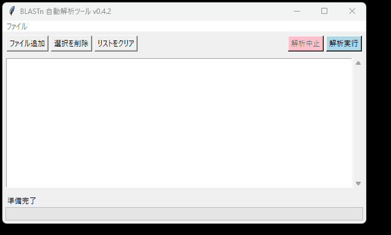

# BlastNavigator

**ローカルBLAST+実行のための、堅牢なGUIフロントエンド (Windows専用)**

BlastNavigatorは、NCBI BLAST+の `blastn` コマンドラインツールを、直感的なグラフィカル・ユーザー・インターフェース（GUI）で安全に実行するための **Windows専用** アプリケーションです。

---

## 🚀 主な機能

* **簡単な操作**
  * 複数FASTAファイルの「ファイル追加」ボタンによる一括登録。
  * 解析順序のドラッグ＆ドロップによる並び替え。
  * ダブルクリックでFASTAファイルをメモ帳で開く機能。
* **堅牢な実行エンジン (v0.4.2)**
  * **設定の事前検証:** 解析実行前に`blastn.exe`やデータベース（`.nal`/`.pal`）の存在をチェックし、設定ミスを即座に通知します 。
  * **詳細なエラーハンドリング:** FASTAファイルの破損やDB名不正によるBLAST実行時エラーを個別に検知し、分かりやすいエラーメッセージを表示します 。
  * **安全な終了処理:** 解析中にウィンドウを「×」ボタンで閉じても、実行中の`blastn`プロセスがPC上に残らない（ゾンビ化しない）よう安全に強制終了します 。
* **効率的な処理フロー**
  * リストの先頭から1ファイルずつ自動で逐次処理（ステートマシンモデル） 。
  * 解析中でもリストの編集（追加・削除・並び替え）が可能 。
  * 解析完了後、成功したFASTAファイルは自動で `processed` フォルダに移動 。
  * 結果は元のファイルと同階層に `_result.csv` として自動出力 。

---

## ⚠️ 必須の事前準備

BlastNavigatorはGUIツール（フロントエンド）です。動作には、以下の2つが別途ローカルPCにインストールされている必要があります。

1. **NCBI BLAST+ 本体**
    * `blastn.exe` を含む実行ファイル群。
    * [NCBI公式FTPサイト](https://ftp.ncbi.nlm.nih.gov/blast/executables/blast+/LATEST/) からダウンロードしてインストールしてください。
2. **BLASTデータベース**
    * `ref_prok_rep_genomes` や `16S_ribosomal_RNA` など、 `makeblastdb` で構築済みのデータベースファイル群（`.nal`, `.nin`, `.nsq`など）。

---

## 📥 インストールと使い方

### 1. アプリケーションの入手

1. 本リポジトリの [**リリースページ**](https://github.com/newamder/BlastNavigator-release/releases) にアクセスします。
2. 最新バージョンの `BlastNavigator_v0.4.2.zip` などをダウンロードし、解凍します。
3. `BlastNavigator.exe` を実行します。

### 2. 初回設定 (必須)

1. アプリを起動し、メニューバーの **[ファイル] > [設定...]** を開きます 。
2. 「必須の事前準備」でインストールした2つの場所を、GUIから正しく指定してください 。
    * **BLAST+ binフォルダ:** `blastn.exe` があるフォルダ（例: `C:\Program Files\NCBI\blast-2.17.0+\bin`）
    * **DBフォルダ:** データベース群（`.nal`ファイルなど）があるフォルダ（例: `J:\blast_db`）
    * **DB名:** 使用するデータベースのベース名（例: `ref_prok_rep_genomes`）
3. [保存] ボタンを押します。（この設定は `config.ini` に保存され、次回から自動で読み込まれます）

### 3. 解析の実行

1. [ファイル追加] ボタンで、解析したいFASTAファイルを追加します。
2. [解析実行] ボタンを押すと、設定の事前検証が実行され、問題がなければリストの上から順に処理が開始されます。

---

**A Robust GUI Frontend for Local BLAST+ (Windows Only)**

BlastNavigator is a **Windows-only** application designed to safely and intuitively run the NCBI BLAST+ (`blastn`) command-line tool via a graphical user interface.

---

## 🚀 Key Features

* **Easy Operation**
  * Add multiple FASTA files at once using the "Add Files" button.
  * Reorder the analysis queue via drag-and-drop.
  * Double-click a file in the list to open it in Notepad.
* **Robust Execution Engine (v0.4.2)**
  * **Pre-flight Validation:** Checks for the existence of `blastn.exe` and database files (`.nal`/`.pal`) *before* running, preventing configuration errors.
  * **Detailed Error Handling:** Detects runtime errors (e.g., corrupted FASTA files, bad DB names) and displays user-friendly error messages.
  * **Safe Exit:** Safely terminates any running `blastn` subprocess when the window is closed, preventing zombie processes.
* **Efficient Workflow**
  * Automatically processes files one-by-one from the top of the list (State Machine Model).
  * **Supports list editing (add, remove, reorder) *while* analysis is running**.
  * Successfully processed FASTA files are automatically moved to a `processed` subfolder.
  * Results are automatically saved as `_result.csv` in the same directory as the source file.

---

## ⚠️ Prerequisites

BlastNavigator is a frontend GUI. You **must** install the following two components on your local machine first:

1. **NCBI BLAST+**
    * The core executables, including `blastn.exe`.
    * Download and install from the [NCBI Official FTP Site](https://ftp.ncbi.nlm.nih.gov/blast/executables/blast+/LATEST/).
2. **BLAST Database**
    * A pre-formatted database (e.g., `ref_prok_rep_genomes` or `16S_ribosomal_RNA`) built with `makeblastdb`.

---

## 📥 Installation and Usage

### 1. Get the Application

1. Go to the [**Releases Page**](https://github.com/newamder/BlastNavigator-release/releases) of this repository.
2. Download the latest version (e.g., `BlastNavigator_v0.4.2.zip`) and extract it.
3. Run `BlastNavigator.exe`.

### 2. First-Time Setup (Required)

1. Launch the app and go to **[File] > [Settings...]**.
2. Point the app to the two components you installed in the "Prerequisites" step.
    * **BLAST+ bin folder:** The folder containing `blastn.exe` (e.g., `C:\Program Files\NCBI\blast-2.17.0+\bin`)
    * **DB folder:** The folder containing your database files (e.g., `J:\blast_db`)
    * **DB name:** The base name of your database (e.g., `ref_prok_rep_genomes`)
3. Click [Save]. (This is saved to `config.ini` and loaded automatically next time).

### 3. Run Analysis

1. Add FASTA files using the [Add Files] button.
2. Click the [Run Analysis] button. The app will validate your settings and begin processing the list.

---

## License

[MIT License](LICENSE)
